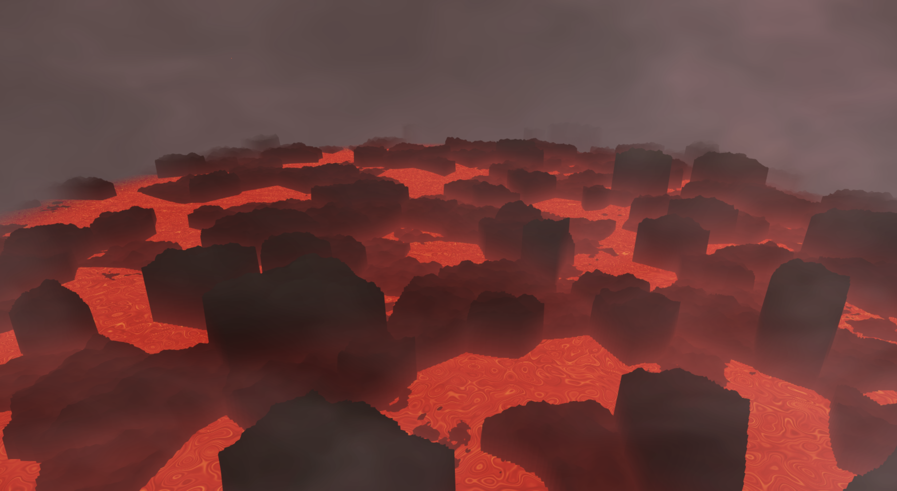

Procedurally Generated Volcanic Scene
=====================================

A project by Nicholas Keenan (pennkey: nkeenan).
Demo Link: https://nkeenan38.github.io/hw01-noisy-terrain

Terrain
--------------

The terrain was generated using a combination of a vironi diagram and fractal brownian motion. The voronoi diagram creates the separate chunks of rock you see. The height of these chunks are a random value with the voronoi seed's (x,z) coordinate as the parameter for the random noise function. 

In addition, fractal brownian noise generated for each position is added to this height to produce a rougher, more natural texture. Also, a slight dropoff is creating by subtracting height away depending on the distance from the voronoi seed position.

Lava
------

The lava is a mostly flat plane with some slight sinusoidal noise to add some variation in the height. The color of the lava is generated with gradient noise to mix between a red and bright orange color. It is slowly animated with a time component in the noise.

Fog / Steam
------

The fog / steam effect is created using an overlay. A vertical plane orthogonal to the viewer is placed in between the camera and the scene. Fractal brownian motion is used to create the cloudy effect by mixing red, white, and black with varying transparencies. \

Embers
-----

The embers were created using an animated voronoi diagram on 2 separate vertical planes at different z-coordinated. Only the centers within a certain radius are drawn in orange, while the rest is transparent.